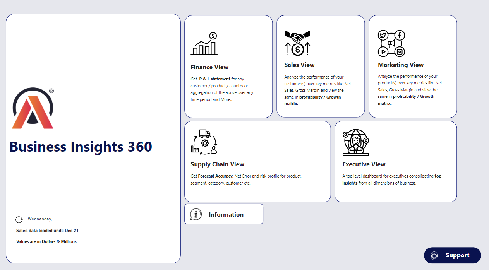

# BUSINESS INSIGHTS 360 for AtliQ Hardware

"BUSINESS INSIGHTS 360 for AtliQ Hardware" is a comprehensive Power BI project developed as part of the Codebasics Data Analytics Bootcamp. This project aims to provide actionable insights into various business functions at AtliQ Hardware, leveraging data analytics and visualization techniques.

## Project Overview
- **Project Name**: BUSINESS INSIGHTS 360 for AtliQ Hardware
- **Tools Used**: Excel, Power BI Desktop, SQL

## Challenges and Objectives
AtliQ Hardware faced challenges in consolidating and analyzing data from diverse sources, which impeded their ability to make informed business decisions. The objective was to develop an interactive report that provided key insights across various business functions, including finance, sales, marketing, supply chain, and executive teams.

## Techniques and Skills Acquired
- **Data Import and Transformation**: Efficiently handled using Power Query.
- **Data Modeling**: Structured for optimal performance and analysis.
- **Visualization Techniques**: Mastered various advanced visualization methods, including:
  - Creating Calculated Columns and DAX Measures: For in-depth analysis.
  - Toggle Buttons: To switch between visuals.
  - Tooltips: To show trends.
  - KPI Indicators: For performance tracking.
  - Conditional Formatting: For enhanced visual appeal.
  - Bookmarks and Selection: Used for creating a dynamic and interactive experience.
- **Report Publishing**: Using Power BI services.

## Business Concepts and Metrics Covered
- Gross Price
- Net Sales
- Pre-invoice deductions
- Post-invoice deductions
- Net Profit
- Net Invoice Sales
- Gross Margin
- COGS (Cost of Goods Sold)
- YTG (Year to Go)
- YTD (Year to Date)
- Net Error

## Dashboard Views Created
- **Finance View**: Designed a dynamic P&L table with slicers for flexible data filtering.
- **Sales View**: Analyzed customer and product performance based on net sales and gross margin percentage.
- **Marketing View**: Focused on product-based performance.
- **Supply Chain View**: Monitored inventory forecasts and net error.
- **Executive View**: Provided a consolidated strategic overview.

## Explore the Live Dashboard
[View Dashboard](https://app.powerbi.com/view?r=eyJrIjoiYTEzNDZjN2ItZTkyNS00ZjJhLWE0MzUtODAwOTg0MTAwNjFkIiwidCI6ImM2ZTU0OWIzLTVmNDUtNDAzMi1hYWU5LWQ0MjQ0ZGM1YjJjNCJ9)
